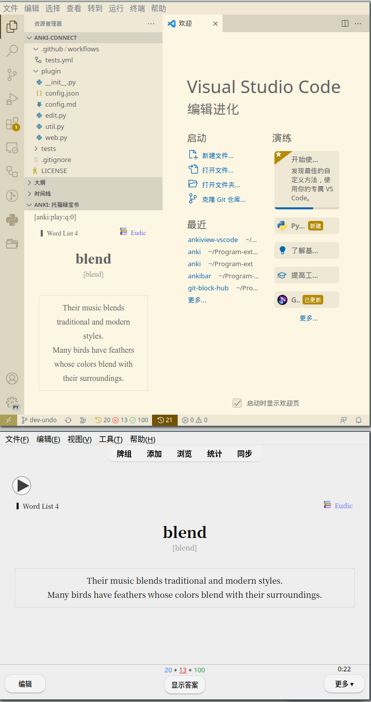

# ankiview

This extension helps you to display [Anki](https://apps.ankiweb.net/) cards in vscode.

## sponsor

> This is a completely free and open-source extension.   
> If you find this project helpful, I would greatly appreciate your sponsorship to help me continue improving and maintaining it.

> 这是一个完全免费和开源的扩展，如果您认为这个项目对您有帮助，  
> 希望能够得到您的赞助，以帮助我继续改进和维护这个项目。  

> これは完全に無料でオープンソースの拡張機能です。  
> もしこのプロジェクトがお役に立つと思われるなら、ご支援をいただければ幸いです。  
> ご支援いただくことで、私はこのプロジェクトの改善とメンテナンスを続けることができます。  
> よろしくお願いいたします。

### Wechat

## dependencies

- [Anki](https://apps.ankiweb.net/)
- [AnkiConnect](https://ankiweb.net/shared/info/2055492159)

## Usage

- Please check [wiki](https://github.com/feilongfl/ankiview-vscode/wiki)

